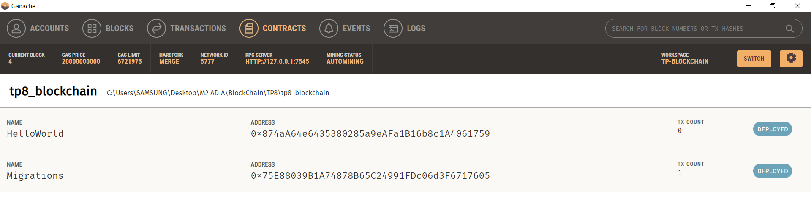
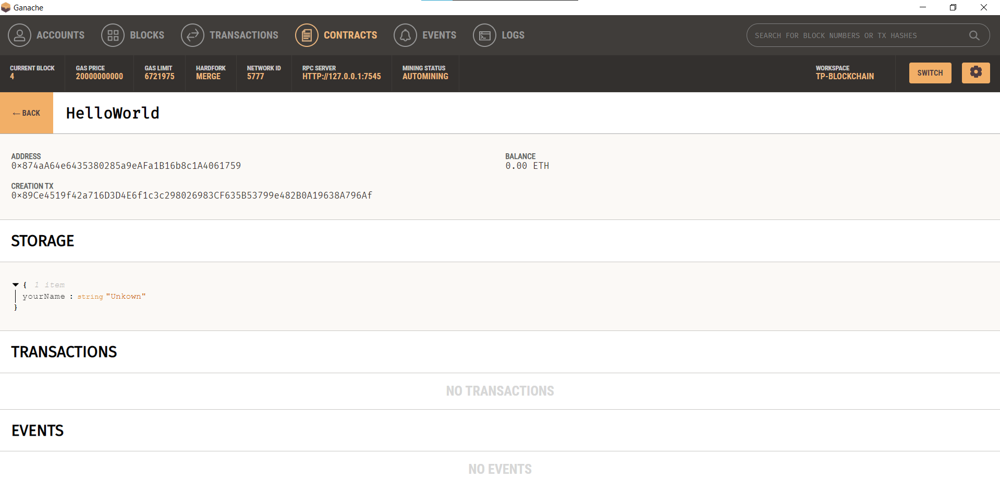
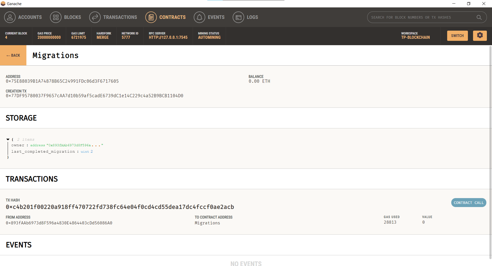
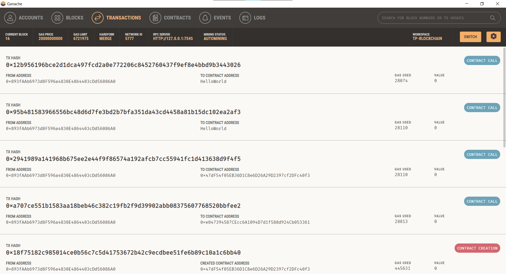
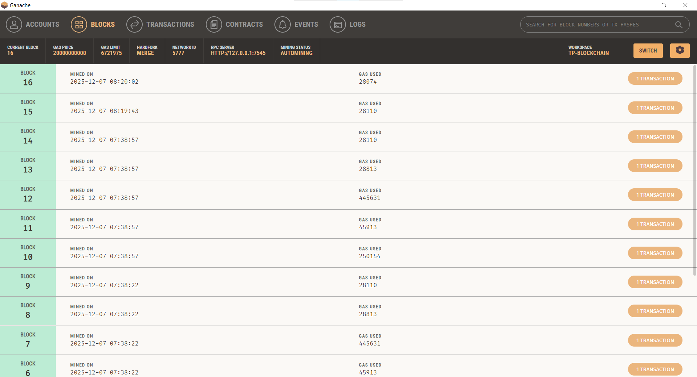
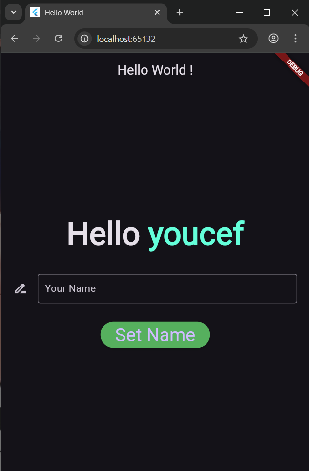

# Rapport de TP 8 : Application Décentralisée (DApp) avec Flutter et Truffle

Ce document résume la démarche suivie pour la réalisation du Travail Pratique n°8, qui consiste à créer une application mobile capable d'interagir avec un contrat intelligent (Smart Contract) sur une blockchain locale.

## 1. Objectif
L'objectif principal est de développer une **DApp** (Application Décentralisée) permettant à un utilisateur de lire et de modifier une variable d'état ("yourName") stockée sur la blockchain Ethereum via une interface Flutter.

## 2. Architecture Technique
Le projet se divise en deux parties interconnectées :
*   **Backend Blockchain** : Développé avec **Solidity** et **Truffle**. Il contient la logique métier (Smart Contract `HelloWorld`).
*   **Frontend Mobile** : Développé avec **Flutter**. Il sert d'interface utilisateur pour envoyer des transactions et lire des données.
*   **Blockchain Locale** : **Ganache** est utilisé pour simuler un réseau Ethereum en local.

## 3. Étapes de Réalisation

### Phase 1 : Déploiement du Contrat Intelligent
Nous avons d'abord configuré l'environnement de développement pour compiler et déployer le contrat.
1.  **Correction du code Solidity** : Ajout de l'identifiant de licence (SPDX) et mise à jour de la syntaxe du constructeur pour la compatibilité avec Solidity 0.8.21.
2.  **Configuration de Truffle** : Ajustement du fichier `truffle-config.js` pour pointer vers le réseau local Ganache (port 7545).

### Phase 2 : Développement de l'Application Flutter
Nous avons structuré l'application Flutter pour gérer la connexion Web3.
1.  **Gestion des Dépendances** : Ajout des bibliothèques `web3dart` (interaction blockchain) et `provider` (gestion d'état) dans `pubspec.yaml`.
2.  **Logique de Liaison (`ContractLinking.dart`)** : Création d'une classe dédiée chargée de :
    *   Se connecter au nœud RPC local.
    *   Charger l'ABI (Application Binary Interface) du contrat depuis le fichier JSON.
    *   Signer et envoyer les transactions.
3.  **Interface Utilisateur (`HelloUI.dart`)** : Conception d'un écran simple permettant d'afficher le nom actuel et d'en saisir un nouveau.

## 4. Problématiques Rencontrées et Solutions

Au cours du développement, plusieurs défis techniques ont dû être résolus :

### A. Incompatibilité de Version EVM (Invalid Opcode)
*   **Problème** : Le déploiement échouait avec une erreur "Invalid Opcode". Cela était dû au compilateur Solidity récent (0.8.21) générant des instructions (`PUSH0`) non supportées par notre version de Ganache.
*   **Solution** : Nous avons forcé l'utilisation d'une version plus ancienne de la machine virtuelle Ethereum ("paris") dans `truffle-config.js`.

### B. Connectivité Web vs Émulateur
*   **Problème** : L'application ne parvenait pas à se connecter à Ganache depuis le navigateur Chrome. L'adresse `10.0.2.2` est spécifique aux émulateurs Android, tandis que le Web requiert `127.0.0.1`.
*   **Solution** : Nous avons standardisé l'adresse RPC sur `http://127.0.0.1:7545` pour assurer la compatibilité avec l'environnement d'exécution Web.

### C. Signature de Transaction (Chain ID Mismatch)
*   **Problème** : Lors de l'envoi d'une modification, l'erreur "Invalid signature v value" apparaissait. Cela indique que l'application signait la transaction pour une blockchain (Chain ID 1) différente de celle utilisée par Ganache (Chain ID 1337 ou 5777).
*   **Solution** : Nous avons explicitement configuré le `chainId` à **1337** dans la méthode d'envoi de transaction pour correspondre à la configuration standard de Ganache.

## 5. Les résultats

## 6. Conclusion
Ce TP a permis de comprendre le cycle de vie complet d'une DApp, de la compilation du contrat à son intégration dans une application cliente. Il a souligné l'importance de la gestion rigoureuse des configurations réseau (ports, Chain IDs) et des versions de compilateur dans l'écosystème blockchain.
